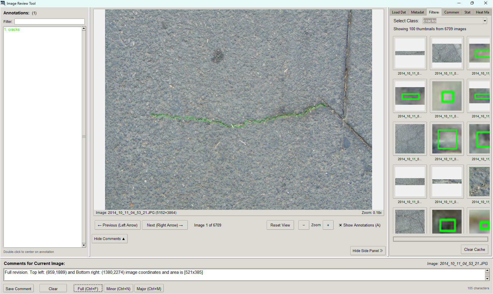

# Image Reviewer Application and Installer Tool

A Python-based desktop application for reviewing annotated images. It supports multiple annotation formats (COCO, PASCAL VOC, YOLO, Binary and WeedCOCO) and displays them over images in a practical three-pane layout. Built with Tkinter, it includes features to streamline the review process and analyze datasets effectively.

### App overview image:


### Demonstration video:


# Features

## Original

- **Annotation Format Support:**  
  Loads annotations from various formats:
    - **COCO:** JSON files with segmentation masks or bounding boxes.
    - **PASCAL VOC:** XML files with bounding box annotations.
    - **YOLO:** Text files with bounding boxes, dynamically reading image dimensions; supports an optional `labels.txt`
      for class names.
    - **WeedCOCO:** An extended COCO format with additional metadata like agricultural contexts, shown in a dedicated
      tab.

- **Annotation Display:**  
  Overlays annotations—bounding boxes or segmentation masks—on images, depending on what’s provided. Highlights specific
  annotations when selected.

- **Filtered Cutouts:**  
  Filters images by annotation class and displays cropped thumbnails of annotated regions. Thumbnails are cached for
  faster loading, and resizing is optimized to keep the interface responsive.

- **Statistics and Heat Maps:**
    - Bar charts summarize annotation counts per class, with interactive Matplotlib controls.
    - Heat maps show the spatial distribution of annotations across images, useful for spotting patterns.

- **User Interface:**
    - **Left Panel:** Lists annotations for the current image, with a filter option.
    - **Center Panel:** Displays the main image with navigation, zoom controls, and a persistent comment section.
    - **Right Panel:** Contains tabs:
        - **Load Data:** Set image/annotation directories, output file, and annotation type.
        - **Filtered:** View class-specific cutouts.
        - **Comments:** Add and review notes per image.
        - **Stats:** Generate annotation statistics.
        - **Heat Map:** Visualize annotation placement.
        - **Metadata:** Display WeedCOCO-specific details (e.g., agricultural context).

- **Persistent Settings and Comments:**  
  Saves configuration (directories and output file) to a settings file in your home directory. Comments are stored in a
  temporary JSON file and persist across sessions, linked to the dataset.

- **Export Functionality:**  
  Exports comments, annotation counts, and class details to an Excel file for further analysis.

## Newly added

- **Annotation Format Support:**  
  Loads annotations from various formats:
    - **Binary:** Binary masks are available (.png preferred) in a folder and need to be converted to the `COCO` format. This option will create `COCO` json file and caches it.
 
- **User Interface:**
    - **Center Panel:** Region selection option. Hold `Ctrl` + `mouse drag` to select the region for major or minor edits.
    - **Right Panel:** Contains tabs:
        - **Load Data:** Annotation type, `Binary` option was added. Furthermore, `Resize images on load`: resizes the masks and original images and caches them for faster usage. Lastly, `Continue where you left`: Loads and continue's from the last reviewed image.     
    - **Bottom Panel:** Comments for Current Image:
        - **Full revision:** `Button` and  `Ctrl + F` keyboard shortcut for the full revision.
        - **Major edits:** `Button` and  `Ctrl + M` keyboard shortcut for the major edits.
        - **Minor edits:** `Button` and  `Ctrl + N` keyboard shortcut for the minor edits.
        - **Layout:** Reduced the layout size compared to the original.
        - **Region selection text:** Added automatic text generation to get the region selection for the major and minor edits. For example: `Minor edits. Top left: (837,1736) and Bottom right: (1719,2472) image coordinates and area is [882x736]`. Supports multiple region selections.
     
- **Installer:**
    - Added Windows `Image Reviewer.exe` installer to easily install the application on Windows OS.
    - Cannot be accessed as a Desktop Shortcut or through the Start button.
    - Opens the GUI application with a `Terminal` to display the progress.
    - Clean, nice and easy installation for someone who are not familiar using the Python program.

# Installation

### Requirements

- Python 3.x
- Tkinter (typically included with Python)
- `opencv-python`
- `Pillow`
- `pandas`
- `matplotlib`
- `numpy`
- `PyInstaller` for the Windows executable file
- `Inno Setup 6` for the GUI installer executable setup

### Install Dependencies

```bash
pip install opencv-python Pillow pandas matplotlib numpy
```

# Acknowledgements
I express my sincere gratitude to Guy Coleman ([geezacoleman](https://github.com/geezacoleman)) for his invaluable time in making the original ([Image Reviewer App](https://github.com/geezacoleman/ImageReviewer)) code public.

# Feedback
Please rate and provide feedback for the further improvements.
